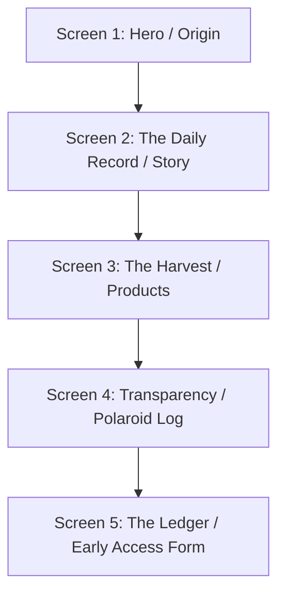

# Brand & System Architecture: Fourth Cow

This document outlines the architectural blueprint, data models, component layout, and future expansion paths for the Fourth Cow digital experience.

---

## 1. Brand Architecture

### Mission & Core Values

- **True Transparency**: Every product is tied directly to a physical resource (e.g., Lakshmi the cow, or tree #42 in the orchard) that customers can actually see.
- **Earthy Sincerity**: Reject the sterile, over-engineered "startup/SaaS" branding. The site should feel like a hand-written personal notebook of a real farmer.
- **Physical Integrity**: Limited production capacity is treated as a point of pride and honesty, not a growth metric.

### Tone of Voice

- Short, simple sentences.
- Asymmetrical layouts mimicking physically taped polaroids and ledger books.
- Earthy color palette: Oat Cream (`#FAF7F0`), Ledger Paper (`#F2EBDC`), Charcoal Ink (`#242622`), Forest Green (`#2C3F2F`), and Terracotta Soil (`#8A6242`).

---

## 2. Content Architecture & Interaction Rules

The application is structured as a single-page long-form journal. All sections flow vertically and natively:



### Critical Interaction Mandates (No Scroll Hijacking)

1. **Standard Browser Physics**: Forcing snap-scroll, capturing manual touch/scroll gestures, or implementing slide-based progress timelines that auto-advance the page is strictly prohibited. Users must have total scrolling control.
2. **Infinite Scannability**: The layout must allow seamless scanning and continuous scrolling. Users should be able to glide through the journal page or flick straight to the early access signup form.
3. **Viewport Scale Safety**: All sections must render with flexible vertical height (using min-height constraints) so that content overflows naturally on smaller display heights rather than being truncated.

---

## 3. Data Model

To ensure seamless extensibility for future farm yields, products are represented by a unified schema:

```typescript
interface Product {
  id: string // Unique identifier (e.g., 'milk', 'ghee', 'honey')
  title: string // Customer-facing title
  limit: string // Realistic daily or seasonal capacity limit
  details: string[] // Bulleted product description points
  status: 'active' | 'coming-soon' | 'seasonal-release'
  deliveryType: 'subscription' | 'pre-order' | 'seasonal'
  category: 'dairy' | 'orchard' | 'experience' | 'apiculture'
}
```

---

## 4. Component Hierarchy

```
App.jsx (Main Layout Container)
 └── Column Viewport (Standard desktop flex-frame / mobile scroll-viewport)
      ├── ScreenHero (Origin Section)
      ├── ScreenStory (Story Section)
      ├── ScreenProducts (Harvest Section)
      ├── ScreenTransparency (Polaroid Log Section)
      └── ScreenEarlyAccess (Ledger Section & Footer)
```

---

## 5. Mobile-first User Journey

1. **Discovery**: User taps a link in an Instagram Story profile.
2. **Landing**: Fits the mobile viewport width (390px) cleanly with zero horizontal overflow.
3. **Consumption**: User scrolls vertically with standard browser scrolling inertia, scanning visual sections naturally.
4. **Navigation**: User can tap CTA buttons (e.g., "Join Early Access") to trigger a smooth native anchor scroll directly to the signup ledger.
5. **Acquisition**: User enters name/phone into the enclosed input boxes and registers.
6. **Storage**: Registration stamps directly to LocalStorage (`fc_registrations`).

---

## 6. Future Expansion Blueprint

This system is built to support the following upcoming features without modifying core layout patterns:

### A. Subscriptions & Pre-orders

- **Glass-Bottle Milk Subscriptions**: Add a toggle on `ScreenProducts` or inside the ledger flow allowing users to choose "Weekly Milk Subscription" vs "One-time Alert".
- **Harvest Pre-booking**: Enable deposit reservations for Mango boxes (via simple stripe integrations or payment pledges in the ledger).

### B. Product Catalog Expansion

Using the `Product` data schema, new elements will be loaded into the `STORY_SCREENS` sequence or listed inside the Products screen:

- **Ghee (Dairy)**: Small-batch clarified butter made from Saraswati and Ganga's milk fat.
- **Wildflower Honey (Apiculture)**: Harvested from the beehives placed in our mango orchard to aid pollination.
- **Farm Visits (Experience)**: Weekend passes during mango harvest season to visit the orchard and meet the cows.

```javascript
// Sample expansion payload for the products engine
const EXTENDED_PRODUCTS = [
  {
    id: 'ghee',
    title: 'A2 Cow Ghee',
    limit: '15 jars per batch capacity',
    details: ['Churned slowly from curd milk fat', 'Infused with local wood fire aroma'],
    status: 'coming-soon',
    deliveryType: 'seasonal',
    category: 'dairy',
  },
  {
    id: 'honey',
    title: 'Orchard Blossom Honey',
    limit: '80 jars seasonal harvest',
    details: ['Raw, unprocessed wildflower honey', 'Harvested directly from orchard beehives'],
    status: 'coming-soon',
    deliveryType: 'seasonal',
    category: 'apiculture',
  },
  {
    id: 'visits',
    title: 'Orchard Walks & Milking',
    limit: '6 visitors per weekend',
    details: ['Meet Lakshmi, Ganga, Yamuna & Saraswati', 'Guided walk through the mango rows'],
    status: 'coming-soon',
    deliveryType: 'pre-order',
    category: 'experience',
  },
]
```
